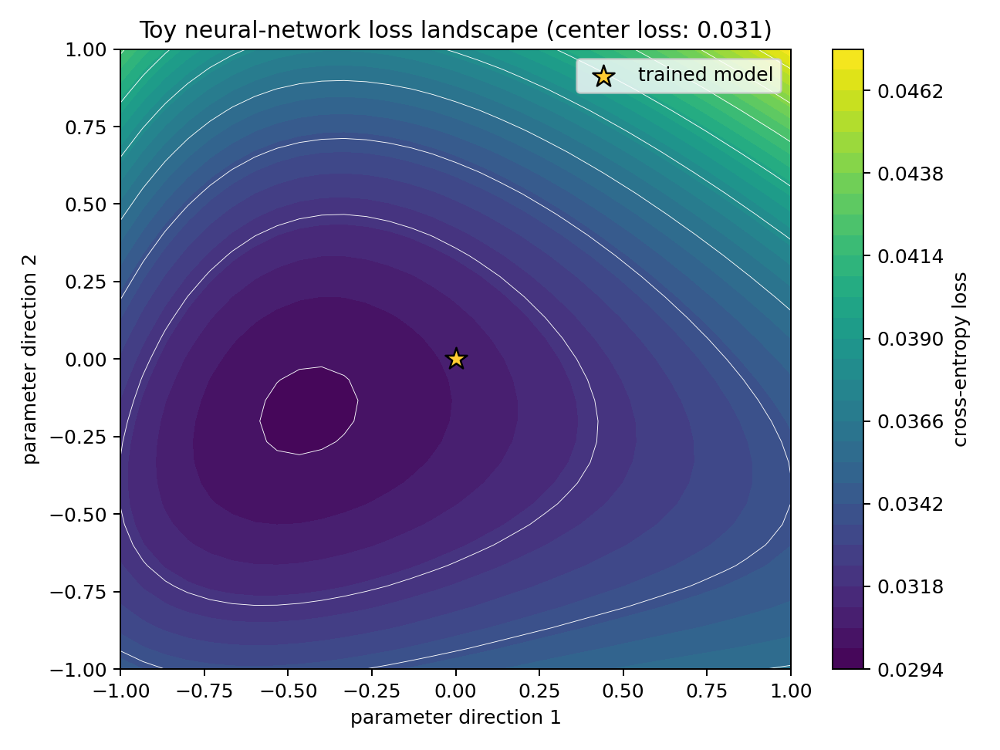

# Evaluating Speaker-Verification Models through Loss Landscapes

[](https://github.com/tassiaheuser/asv_losslandscape/actions/workflows/quality.yml)

Research code for the master thesis *Evaluating ResNet-based Speaker Verification Systems through
Loss Landscape Visualization* by Tassia Heuser at Technische Universität Berlin, and the follow-up
paper *Understanding Optimization Dynamics in Robustness and Generalization of ResNet-based Speaker
Verification through Loss Landscape Geometry*.

The repository combines two related codebases:

- [`voxceleb/`](voxceleb/) trains and evaluates automatic speaker-verification models.
- [`loss-landscape/`](loss-landscape/) generates and visualizes loss landscapes for those models.

Both components extend existing open-source projects. See the component READMEs and
[`NOTICE.md`](voxceleb/NOTICE.md) for upstream attribution.

## What this repository produces

Loss landscapes visualize how a model's loss changes along two directions in parameter space. The
star below marks a trained model in a fully self-contained educational example:



Recreate the figure without VoxCeleb data or checkpoints:

```bash
python -m pip install numpy matplotlib
python examples/toy_loss_landscape.py
```

This toy figure demonstrates the workflow and is not a reported thesis result. Thesis experiments
use the speaker-verification models and configs documented below.

## Release status

The source code and data-preparation tools are included. VoxCeleb audio, generated HDF5 datasets,
experiment outputs, and model checkpoints are intentionally excluded because they are large and
may have separate access or redistribution terms. The example experiment configurations therefore
require you to supply the referenced data and checkpoints or adjust their paths.

## Repository layout

```text
loss-landscape/   Loss-landscape computation and plotting
voxceleb/         Speaker-verification training and evaluation
tests/            Lightweight publication and dataset-builder tests
examples/         Self-contained toy loss-landscape example
docs/             Reproduction metadata and public-release assets
```

## Quick start

Create separate environments for the two components so their dependencies can evolve
independently:

```bash
cd voxceleb
python -m venv .venv
source .venv/bin/activate
python -m pip install -r requirements.txt
python trainSpeakerNet.py --help
```

For loss-landscape analysis:

```bash
cd loss-landscape
python -m venv .venv
source .venv/bin/activate
python -m pip install -r requirements.txt
python plot_surface.py --help
```

Detailed data layouts and commands are documented in the
[`voxceleb` README](voxceleb/README.md) and
[`loss-landscape` README](loss-landscape/README.md).

For the pinned reference environment, add the shared constraints file while installing:

```bash
python -m pip install -r requirements.txt -c ../constraints/research-environment.txt
```

## Data access

Obtain VoxCeleb data through the
[official access page](https://www.robots.ox.ac.uk/~vgg/data/voxceleb/) and follow its terms of use.
Do not commit audio, credentials, HDF5 datasets, or checkpoints. This repository deliberately does
not automate authenticated VoxCeleb downloads. The preparation tool processes archives obtained
through the official workflow and downloads only public augmentation data over verified HTTPS.

## Validation

The GitHub Actions workflow checks Python syntax, YAML and notebook validity, shell syntax, and the
dataset builder's core behavior. Run the local tests from the repository root with:

```bash
python -m unittest discover -s tests -v
```

Full training and landscape generation are not CI tests because they require restricted datasets,
checkpoints, GPUs, and substantial compute.

## Reproducing the research workflow

- [`docs/REPRODUCING.md`](docs/REPRODUCING.md) gives the end-to-end sequence.
- [`docs/EXPERIMENTS.md`](docs/EXPERIMENTS.md) maps experiment families to configs and artifacts.
- [`docs/checkpoints.example.yml`](docs/checkpoints.example.yml) is the metadata template for
  checkpoints once redistribution details are confirmed.
- [`docs/MODEL_SNAPSHOTS.md`](docs/MODEL_SNAPSHOTS.md) explains why model implementations appear in
  both components.

## Citation

Citation metadata is provided in [`CITATION.cff`](CITATION.cff). Please also cite the upstream
papers listed in the component READMEs when using the corresponding code.

## Release and support

Changes are recorded in [`CHANGELOG.md`](CHANGELOG.md). See [`CONTRIBUTING.md`](CONTRIBUTING.md) for
the validation workflow and [`SECURITY.md`](SECURITY.md) for private vulnerability reporting.

## License

Original contributions in this repository are released under the MIT License; see
[`LICENSE`](LICENSE). Vendored and adapted third-party portions retain their upstream notices and
license terms in [`loss-landscape/LICENSE`](loss-landscape/LICENSE),
[`voxceleb/LICENSE.md`](voxceleb/LICENSE.md), and [`voxceleb/NOTICE.md`](voxceleb/NOTICE.md).
